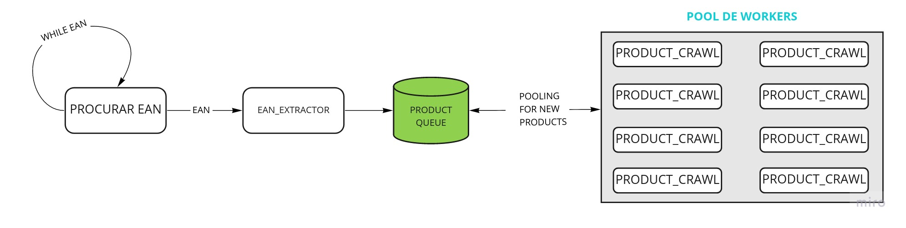
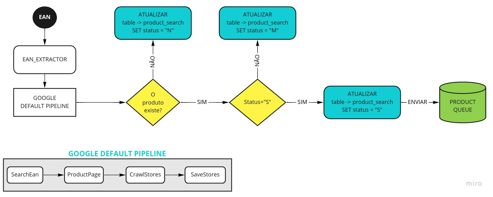
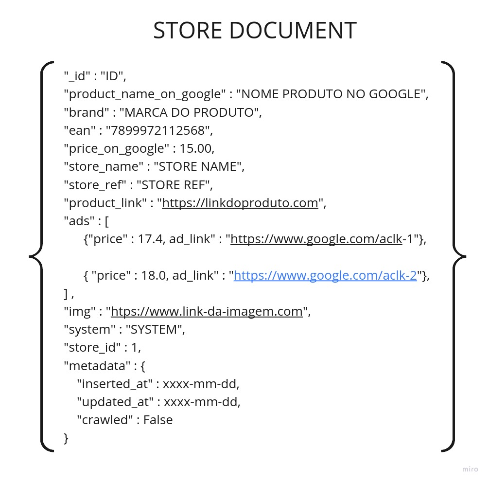
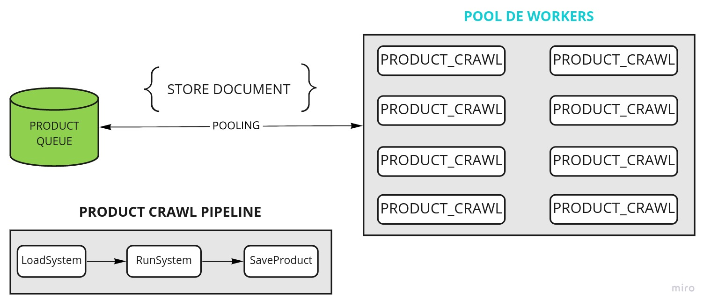

# Google Scrapper

This project finds EAN in google shopping, and save it in postgres database, and mongodb simulating a message broker.

# Overview geral

This project uses the EDA (Event Driven Architecture), and has two extra commands to execute a pipeline of data extraction.

## EAN EXTRACTOR

The first one is `ean_extractor`, and it's responsible for receive an ean, and check if this product exists on google shopping.
If it exists, the flow goes on, and all information about the product, thus other ads in each store (Magazine Luiza, Casas Bahia, etc),
and save this data on a table called as `data_quality` and `comparison` in the Postgres. Furthermore, all the other products found
in the page are sent to the queue to be processed in paralel.
The actual EAN is updated on database, if status `S` when there is only a single option on google shopping, `M` when there are
multiple products found, and `N` when nothing was found.

## STORE SPIDER

This command is responsible for reading a QUEUE with data from each STORE crawled and its respectives ADS extracted for a MAIN EAN.
Case we have an extraction template active for this store, the template spider is activated, extracting all information available
on the page, and sending the extracted data to a table called as `data_quality` (relating its store to this row extracted).

Each STORE's AD is followed, extracted and save their attributes, like `product_name`, `color`, `model`, and others.

# Project Flow

## Ean Search

___________________________________________________________

### Sent product to QUEUE example

___________________________________________________________

## Product's Spider Workers

________________________________________________________  

# Desenvolvimento local

## SETUP
- Clone o projeto;
- Abra um terminal no root do projeto;
- Logo em seguida digite `make setup`

## Injetando url bancos de dados ou rodando local

- No terminal, digite: `make up` (irá criar uma instância do `mongodb` e uma do `postgres` localmente)

# Startando pool de workers dos spiders

- Abra um terminal no root e digite (workers você pode definir o número de workers)
    - make start-product-crawl-worker workers=`numero de workers`

exemplo: 
    - make start-product-crawl-worker workers=5

# Crawleando um EAN especifico

## Apenas rodando o EAN EXTRACTOR e enviando o resultado para fila
- Abra outro terminal no root do projeto e digite:
    - make start-ean-extractor ean=`ean desejado`

## RODA o EAN EXTRACTOR, ATUALIZA na TABLE `google.products_search` e envia para fila
- Abra outro terminal no root do projeto e digite:
    - make start-ean-extractor-and-update-table data=`data da extracao` ean=`ean desejado`

EXEMPLO:
- make start-ean-extractor-and-update-table data="2022-07-18" ean="1020304050"

O processo será efetuado, e alguns prints serão mostrados, como o status do processamento (S | N | M)
e outras informações.

________________
# PORTUGUESE

# Google Scrapper

Projeto responsável por efetuar a coleta de dados no google shopping, partindo da busca por um EAN.

# Overview geral

O projeto foi desenvolvido sobre a arquitetura EDS (Event Driven System), e possui dois comandos complementares,
e cada comando tem a sua pipeline de comportamentos a serem executados.

## EAN EXTRACTOR

O primeiro comando é chamado de `ean_extractor`, e este é responsável por receber um ean, e verificar se o produto
existe no google shopping. Se este existir, o fluxo segue, e as informações do produto assim como os anúncios de
cada loja que tem esse produto disponível, salva as informações relevantes do google na tabela `data_quality` e
`comparison` no Postgres, além de enviar a loja e seus anúncios encontrados para a fila para serem executados pelo
próximo comando. O EAN atual na fila é atualizado no Postgres, com status `S` quando existe uma única classificação
de produtos, `M` quando existem múltiplas ocorrências no campo `MELHOR CORRESPODÊNCIA`, e `N` quando o ean não pode ser
encontrado.

## STORE SPIDER

Este comando é responsável por ler a fila com os dados de cada loja e seus respectivos anúncios extraídos pelo ean.
Caso tenhamos template ativo para extração dos dados referente a loja, o spider deste template é ativado, extraindo as
informações da página, e enviando os dados extraídos para a tabela associada a este spider no postgres, e também a tabela
`data_quality`.

Cada anúncio da loja é percorrido, extraído dados como `nome do produto`, `atributo` (voltagem ou cor), `modelo`, entre outros.

# Fluxuograma do Projeto

## Ean Search

___________________________________________________________

### Exemplo de documento enviado para fila

___________________________________________________________

## Product's Spider Workers

________________________________________________________  

# Desenvolvimento local

## SETUP
- Clone o projeto;
- Abra um terminal no root do projeto;
- Logo em seguida digite `make setup`

## Injetando url bancos de dados ou rodando local

- No terminal, digite: `make up` (irá criar uma instância do `mongodb` e uma do `postgres` localmente)

# Startando pool de workers dos spiders

- Abra um terminal no root e digite (workers você pode definir o número de workers)
    - make start-product-crawl-worker workers=`numero de workers`

exemplo: 
    - make start-product-crawl-worker workers=5

# Crawleando um EAN especifico

## Apenas rodando o EAN EXTRACTOR e enviando o resultado para fila
- Abra outro terminal no root do projeto e digite:
    - make start-ean-extractor ean=`ean desejado`

## RODA o EAN EXTRACTOR, ATUALIZA na TABLE `google.products_search` e envia para fila
- Abra outro terminal no root do projeto e digite:
    - make start-ean-extractor-and-update-table data=`data da extracao` ean=`ean desejado`

EXEMPLO:
- make start-ean-extractor-and-update-table data="2022-07-18" ean="1020304050"

O processo será efetuado, e alguns prints serão mostrados, como o status do processamento (S | N | M)
e outras informações.
